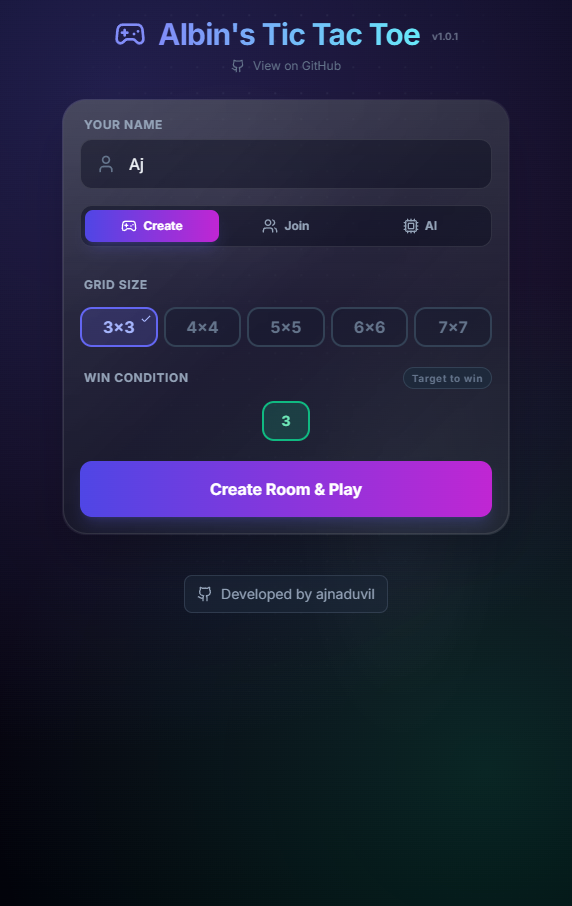
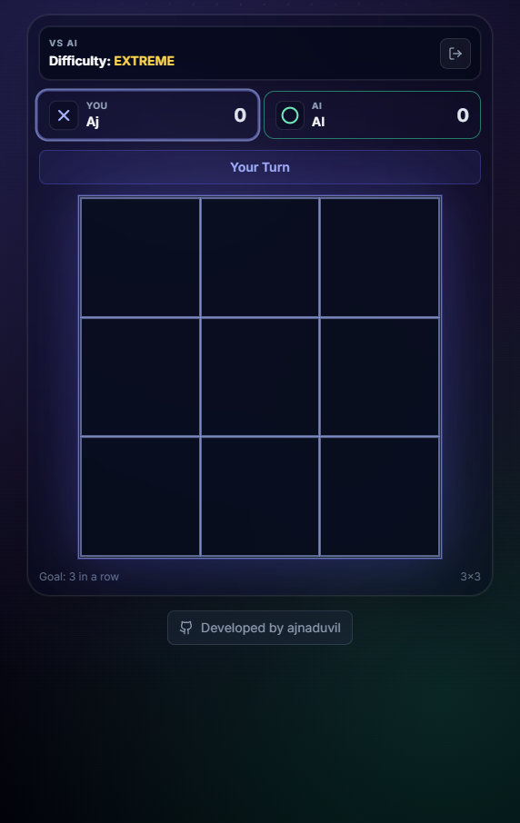
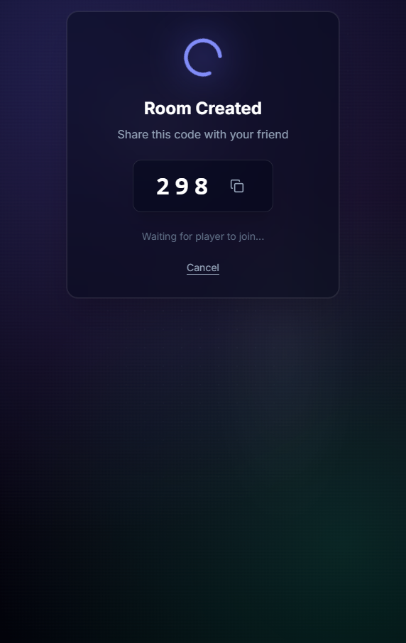

<div align="center">
  <h1>Albin's Tic Tac Toe</h1>
  <p>Real-time, peer-to-peer Tic Tac Toe — create a room, share a 3-digit code, and play instantly.</p>

  <p>
    <a href="https://albins-tic-tac-toe.vercel.app/">🌐 Live App</a> • 
    <a href="https://github.com/ajnaduvil/albins-tic-tac-toe">📦 GitHub</a> • 
    <a href="screenshots/README.md">📸 Screenshots</a>
  </p>
</div>

## About

This is a **browser-based multiplayer Tic Tac Toe** game built with **React + TypeScript + Vite** and powered by **PeerJS (WebRTC)** for real-time, peer-to-peer gameplay.

No accounts, no backend: the host creates a room code, the other player joins, and the game state syncs directly between browsers.

## Screenshots

<div align="center">
  
  <p><em>Welcome screen with game mode selection</em></p>
</div>

<div align="center">
  
  <p><em>AI game mode with customizable difficulty</em></p>
</div>

<div align="center">
  
  <p><em>Multiplayer room creation with shareable code</em></p>
</div>

See all screenshots in the [Screenshots Gallery](screenshots/README.md).

## Features

- **P2P real-time multiplayer** via WebRTC (PeerJS)
- **Single-player AI mode** with 4 difficulty levels (Easy, Medium, Hard, Extreme)
- **Room codes** (3 digits) for quick sharing
- **Custom board sizes**: 3×3 up to 7×7
- **Custom win condition**: 3-in-a-row up to 7-in-a-row (bounded by grid size)
- **Rematch flow + score tracking**
- **In-game chat** (with customizable quick-message presets)
- **Animated emoji reactions** using LiveEmoji library
- **Sound effects** for moves and game outcomes
- **Move highlighting** (last move stays highlighted for 10 seconds)
- **"Nudge" feature** (shake animation to get opponent's attention)
- **Confetti celebrations** (different effects for wins vs draws)
- **Mobile optimizations** (numeric keypad, fixed CTAs, responsive design)
- **Local storage** for game preferences and chat presets

## How it works (quick)

- The host creates a room and gets a **3-digit code**.
- Under the hood that code maps to a PeerJS peer id (see `hooks/usePeerGame.ts`).
- Players connect via WebRTC; moves/chat/emotes are sent over the data channel.

## Single Player AI Mode

Challenge yourself against an AI opponent with 4 difficulty levels:

- **Easy**: Random moves with basic strategy
- **Medium**: Minimax algorithm with limited depth
- **Hard**: Advanced minimax with alpha-beta pruning (unbeatable on 3×3)
- **Extreme**: Deeper search for larger boards, takes longer to think

The AI uses intelligent heuristics that consider winning combinations, blocking moves, and positional advantages.

## Audio & Visual Enhancements

- **Sound Effects**: Web Audio API-generated sounds for moves (X/O tones) and game outcomes (win/lose/draw melodies)
- **Animated Emojis**: LiveEmoji library provides smooth animated reactions for 9 different emojis
- **Move Highlighting**: Last played move is highlighted for 10 seconds to track game flow
- **Nudge Animation**: Screen shake effect to get your opponent's attention
- **Confetti Effects**: Different celebration styles - blue/purple for wins, yellow/gold for draws
- **Visual Feedback**: Smooth animations, hover effects, and responsive transitions throughout the UI

## User Experience Features

- **Mobile Optimized**: Numeric keypad for room code entry, fixed bottom action buttons, responsive design
- **Chat System**: Real-time messaging with customizable preset messages (default: "Nice move!", "GG", "Unlucky", "Rematch?", "Hurry up!")
- **Local Storage**: Game preferences (grid size, win condition, AI difficulty) and chat presets are automatically saved
- **Accessibility**: Proper ARIA labels, keyboard navigation, and screen reader support
- **Progressive Enhancement**: Works without JavaScript for basic functionality, enhanced with JS enabled

## Getting started (local dev)

### Prerequisites

- Node.js (recommended: **18+**)

### Install

```bash
npm install
```

### Run

```bash
npm run dev
```

Vite runs on `http://localhost:3000` by default.

### Build & preview

```bash
npm run build
npm run preview
```

## Scripts

- **`npm run dev`**: start dev server
- **`npm run build`**: production build
- **`npm run preview`**: preview the production build locally
- **`npm run deploy`**: deploy to Vercel (`vercel --prod`)

## Deploying

### Vercel (recommended)

- **Via Vercel UI**: import the repo and deploy as a Vite app (output: `dist`).
- **Via CLI**:

```bash
npx vercel --prod
```

## TURN Server Setup (Optional but Recommended)

For reliable connections across different networks (PC↔mobile, different locations), you can configure a TURN server. The app includes support for **Turnix.io** TURN servers.

### Setup Steps

1. **Get a Turnix.io API token**:
   - Sign up at [Turnix.io](https://turnix.io/)
   - Create a project and generate an API token (free tier: 10 GB/month)

2. **Add environment variable in Vercel**:
   - Go to your Vercel project → **Settings** → **Environment Variables**
   - Add:
     - **Name**: `TURNIX_API_TOKEN`
     - **Value**: Your Turnix.io API token
     - **Environment**: Production, Preview, Development (select all)

3. **Redeploy**:
   - The app will automatically fetch TURN credentials from your serverless function
   - If TURN is unavailable, the app gracefully falls back to STUN-only

### How it works

- The app includes a Vercel serverless function (`api/get-turn-credentials.ts`) that securely fetches TURN credentials from Turnix.io
- Your API token stays server-side (never exposed to clients)
- TURN servers are fetched once on app load and included in WebRTC configuration
- If TURN fetch fails, the app continues with STUN-only (graceful degradation)

## Notes / limitations

- **P2P connectivity varies by network**: some strict NAT/firewall setups may fail without a TURN server. **Adding TURN (see above) resolves this**.
- **Room codes are short**: treat them like "easy sharing", not security.
- **Privacy**: gameplay/chat data is sent peer-to-peer over WebRTC (encrypted transport), but signaling uses PeerJS infrastructure.

## Contributing

PRs and issues are welcome. If you’re proposing a bigger change, open an issue first so we can align on scope.

## License

This project is licensed under the **MIT License**. See the [LICENSE](LICENSE) file for details.

Copyright (c) 2024 Albin
